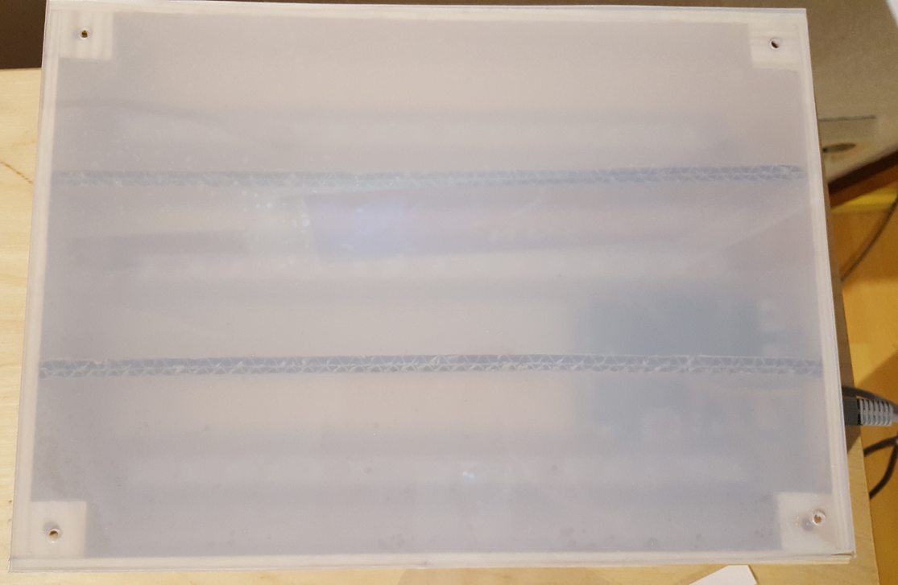
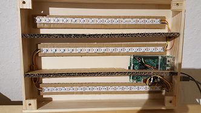
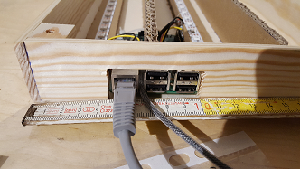
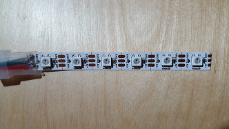
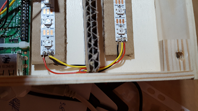
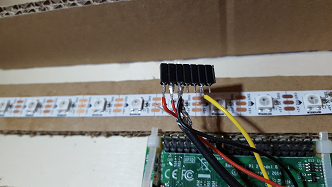
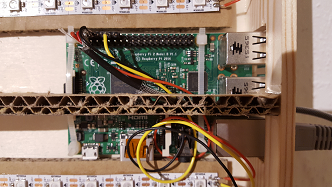

# Build Instructions for the Lighthouse-Case

This describes the build of a A4 lightbox. The dimensions are DIN A4: 29 x 21 cm.

The basic idea is to create a box covered with opaque plexiglas and mount the LED-strips and the raspberry pi inside.

## Preparations

### Tools

  - Saw
  - Plastic Glue (Uhu)
  - Drill
  - Wood saw
  - Sharp knife
  - soldering iron
  
### Materials

  - plywood (A4: 29 x 21 cm)
  - acrylic glas (plexiglas) opaque (A4: 21 x 29 cm)
  - wood ledge (40 x 5 mm) ~ 1,10 meter 
  - 4 wood-skews 3,5x16 mm
  - 8 cable straps  3 mm (for mounting the raspi)
  - Raspberry pi (1/2/3)
  - Wires (red/black/yellow)
  - GPIO-Female coupler
  - LED-Lightstrip WS 2812 B 
  - USB-Cable
  - 5V USB charger (minimum 1,5 Ampere!)

### Remarks
  
The acrylic glas is expensive. I used a self adhesive opaque foil which worked fine.
I bought plywood already cut to DIN A4 (21x29 cm)
The Dimensions are very easy to change. You can use a sharp knive to cut the plywood and plexiglas.
  
## Assembly
  
### Casing

Cut the acrylic glass with a sharp knife.
Cut the wood ledge (40x5 mm) in 2 pieces 29 cm and 2 pieces 20 cm. 
4 pieces 20x20x5 mm for mounting the plywood to the back

Cut the access to the raspberry pi on one small wood ledge at 4,5 cm and at 10 cm (5,5 cm x 2,4 cm). 

Glue the wood ledge pieces with the plastic glue on the plexiglas.

The plywood will hold the raspberry pi and the led-lightstrips.

Glue the mountings in the corners.

Attache the plywood and drill 2mm holes in the corners through both (plywood and mountings).
Widen the holes in the plywood.

### LED-Strip

One line has 15 LEDs. Cut them with a sharp scissors at the marked separation lines. 

Glue the LED-Stips on a cardboard. Ensure, that the strip is placed flat; per haps you have to bend it.
Place the Raspberry pi on the plywood and arrange its fitting with the its access hole.

Later we will solder the Dout to Din (where we just cut LED-Lightstrip) so ensure that you place Dout of one line on the side Din at the other line.

Now glue the LED-Lightstrip on the plywood.
Drill 3mm holes for the raspberry pi.

Solder the pins: +5V for the red cable. GND the black cable. Data will be the yellow. 
The data in of the first line is connected to GPIO-PIN 12 (logically its named GPIO 18)

Important:
The data out of line 1 is connected to data in of line 2.
The data out of line 2 is connected to data in of line 3.

Connect +5V of each line once.
Connect GND of each line once.

### GPIO soldering

Solder +5V to GPIO-PIN 4. GND to GPIO-PIN 6 and and Data to GPIO-PIN 12.
I used a brigde with 7 female coupler.

Please double check the soldering!
You may destroy your devices!

### Power supply
DOUBLE-CHECK THE POLARITY!!!!
Solder the red wire of the USB cable (+5V) to PIN 2.
Solder the black wire of the USB cable (GND) to PIN 6.

### Raspberry pi

Use the cable straps to attach the raspberry pi.

### Finally

Close the box and test it.